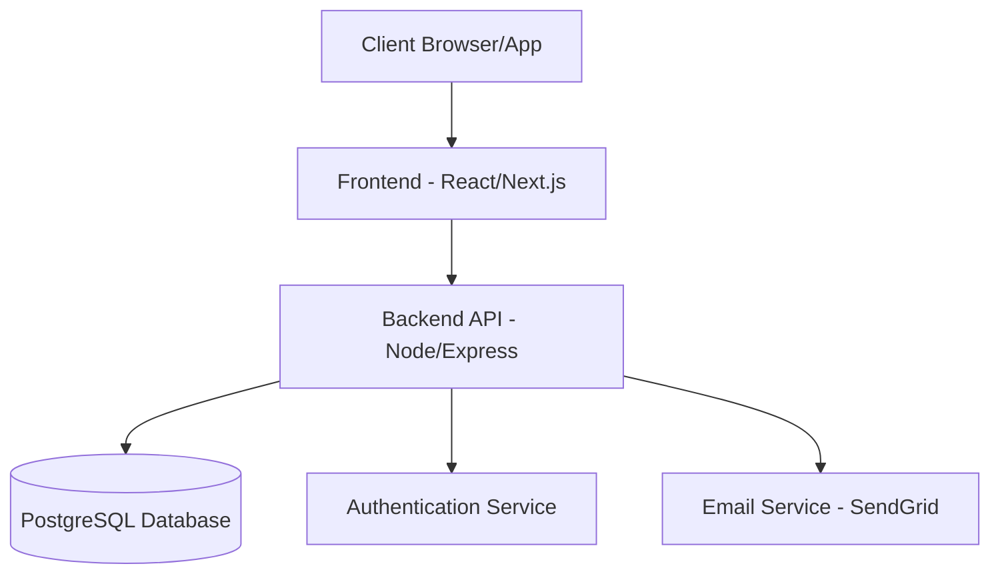
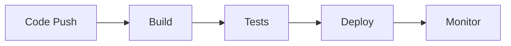

# 🏗️ TLP Systems App – System Architecture

This document outlines the system architecture, component interactions, infrastructure setup, and security measures implemented in the TLP Systems App.

## 🌐 System Overview

## 🧱 Component Architecture

### Frontend Layer

- **Framework**: React.js with Next.js
- **State Management**: React Context + Hooks
- **UI Components**: Custom components + Tailwind CSS
- **API Integration**: Axios/Fetch with typed interfaces
- **Authentication**: JWT token management
- **Routing**: Next.js file-based routing

### Backend Layer

- **Runtime**: Node.js v22.x
- **Framework**: Express.js
- **ORM**: Prisma
- **API Style**: RESTful with versioning
- **Authentication**: Custom RBAC + JWT
- **Validation**: Express validators
- **Logging**: Winston/Morgan

### Database Layer

- **Engine**: PostgreSQL
- **Schema**: Prisma-managed migrations
- **Backup**: Automated daily snapshots
- **Scaling**: Connection pooling via PgBouncer

### Service Integration

- **Email**: SendGrid/SMTP integration
- **File Storage**: Local/Cloud (configurable)
- **Monitoring**: Custom health checks
- **Caching**: In-memory + Redis (optional)

## 🏭 Infrastructure Setup

### Development Environment

- Local development using Docker containers
- Hot-reloading enabled for both FE/BE
- Local PostgreSQL instance
- Mock email service for testing

### Staging Environment

- Hosted on Google Cloud Platform
- Automated deployments via GitHub Actions
- Staging database with sanitized data
- Test email delivery sandbox

### Production Environment

- High-availability setup on GCP
- Load balanced API servers
- Managed PostgreSQL instance
- Production-grade email service
- CDN for static assets

## 🔒 Security Architecture

### Authentication

- JWT-based authentication
- Secure token storage
- Password hashing with bcrypt
- MFA support (optional)

### Authorization

- Role-Based Access Control (RBAC)
- Resource-level permissions
- API endpoint protection
- Data access filtering

### Data Protection

- Data encryption at rest
- Secure communication (HTTPS)
- SQL injection prevention
- XSS protection
- CSRF tokens

### Audit & Compliance

- Action logging
- User session tracking
- Data access logs
- Error monitoring

## 📈 Scalability & Performance

### Frontend Optimization

- Code splitting
- Static generation where possible
- Image optimization
- Caching strategies

### Backend Scaling

- Horizontal scaling capability
- Load balancing
- Rate limiting
- Connection pooling

### Database Optimization

- Indexed queries
- Query optimization
- Connection pooling
- Regular maintenance

## 🔄 Deployment Architecture

### CI/CD Pipeline

### Deployment Process

1. Code pushed to repository
2. Automated tests run
3. Build Docker images
4. Deploy to staging
5. Run integration tests
6. Deploy to production
7. Health checks
8. Monitoring alerts setup

### Rollback Strategy

- Automated rollback triggers
- Version tracking
- Database migration reversibility
- State recovery procedures

## 📊 Monitoring & Logging

### System Monitoring

- Application metrics
- Server resources
- Database performance
- API response times

### Error Tracking

- Error logging
- Stack traces
- User context
- Environment data

### Performance Monitoring

- Page load times
- API latency
- Database query times
- Resource usage

### Health Checks

- API endpoints
- Database connectivity
- External services
- System resources

## 🔄 Backup & Recovery

### Database Backups

- Daily automated backups
- Point-in-time recovery
- Backup verification
- Retention policies

### Disaster Recovery

- Recovery procedures
- Data restoration steps
- Service continuity plan
- Incident response

## 📱 Mobile Considerations

### Responsive Design

- Mobile-first approach
- Progressive enhancement
- Touch-friendly interfaces
- Offline capabilities

### Performance

- Minimal bundle size
- Image optimization
- Lazy loading
- Service workers

---

This architecture document is maintained by the TLP Systems development team and should be updated as the system evolves.
