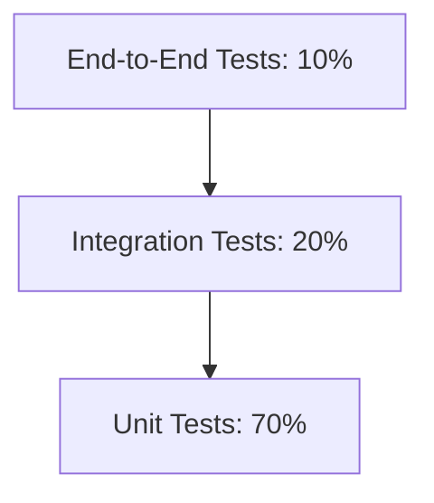

# 🧪 TLP Systems App – Testing Guide

This guide outlines our testing strategy, setup procedures, and best practices for maintaining high code quality across the TLP Systems App.

## 📋 Testing Strategy

### Test Pyramid



### Test Types & Coverage Goals

- Unit Tests: 80% coverage
- Integration Tests: Key workflows
- E2E Tests: Critical user paths
- Performance Tests: API endpoints
- Accessibility Tests: WCAG compliance

## 🛠️ Testing Setup

### Unit Testing

```bash
# Install testing dependencies
npm install --save-dev jest @testing-library/react @testing-library/jest-dom

# Run unit tests
npm run test
npm run test:coverage
```

#### Test Structure

```typescript
describe('ComponentName', () => {
  beforeEach(() => {
    // Setup
  });

  it('should render correctly', () => {
    // Test
  });

  afterEach(() => {
    // Cleanup
  });
});
```

### Integration Testing

```bash
# Install Cypress
npm install --save-dev cypress

# Run integration tests
npm run test:integration
```

#### API Integration Tests

- Request validation
- Response format
- Error handling
- Authentication flows
- Data persistence

### E2E Testing

```bash
# Install Playwright
npm install --save-dev @playwright/test

# Run E2E tests
npm run test:e2e
```

#### Critical Paths

1. User authentication
2. Leave request workflow
3. Locum assignment
4. Finance approvals
5. Incident reporting

## 📊 Test Data Management

### Test Database

- Separate test database
- Seeded test data
- Reset between tests
- Factories for test data

### Mock Data

```typescript
// User factory example
const createTestUser = (overrides = {}) => ({
  id: 1,
  name: 'Test User',
  email: 'test@example.com',
  role: 'STAFF',
  ...overrides
});
```

## 🔄 CI/CD Integration

### GitHub Actions Workflow

```yaml
name: Test Suite
on: [push, pull_request]
jobs:
  test:
    runs-on: ubuntu-latest
    steps:
      - uses: actions/checkout@v2
      - name: Run Tests
        run: |
          npm install
          npm test
```

### Pre-commit Hooks

```bash
# Install husky
npm install --save-dev husky

# Configure hooks
npm set-script prepare "husky install"
npx husky add .husky/pre-commit "npm test"
```

## 📝 Testing Guidelines

### Unit Test Best Practices

- Test one thing per test
- Use descriptive test names
- Arrange-Act-Assert pattern
- Mock external dependencies
- Test edge cases

### Component Testing

```typescript
import { render, screen } from '@testing-library/react';
import userEvent from '@testing-library/user-event';

test('button click handler is called', async () => {
  const handleClick = jest.fn();
  render(<Button onClick={handleClick}>Click Me</Button>);
  
  await userEvent.click(screen.getByText('Click Me'));
  expect(handleClick).toHaveBeenCalled();
});
```

### API Testing

```typescript
describe('POST /api/leave', () => {
  it('creates a leave request', async () => {
    const response = await request(app)
      .post('/api/leave')
      .send(validLeaveRequest);
    
    expect(response.status).toBe(201);
    expect(response.body).toHaveProperty('id');
  });
});
```

## 🎯 Test Coverage Requirements

### Frontend Coverage

- Components: 80%
- Hooks: 90%
- Utils: 95%
- Store: 90%

### Backend Coverage

- Controllers: 90%
- Services: 90%
- Models: 85%
- Middleware: 95%

## 🐛 Debug Tools

### Browser Testing

- React DevTools
- Redux DevTools
- Network Inspector
- Console Logging

### API Testing

- Postman Collections
- REST Client files
- SwaggerUI
- Jest Debug Config

## 📊 Performance Testing

### Load Testing

```bash
# Install k6
npm install --save-dev k6

# Run load tests
k6 run load-tests.js
```

### Metrics Tracked

- Response time
- Error rate
- Throughput
- Resource usage

## 🔄 Continuous Testing

### Watch Mode

```bash
# Start test runner in watch mode
npm run test:watch
```

### Test Reports

- JUnit XML format
- HTML coverage reports
- Console summaries
- CI/CD integrations

---

## 📚 Resources

- [Jest Documentation](https://jestjs.io/)
- [React Testing Library](https://testing-library.com/react)
- [Cypress Guides](https://docs.cypress.io/)
- [Playwright Docs](https://playwright.dev/)
